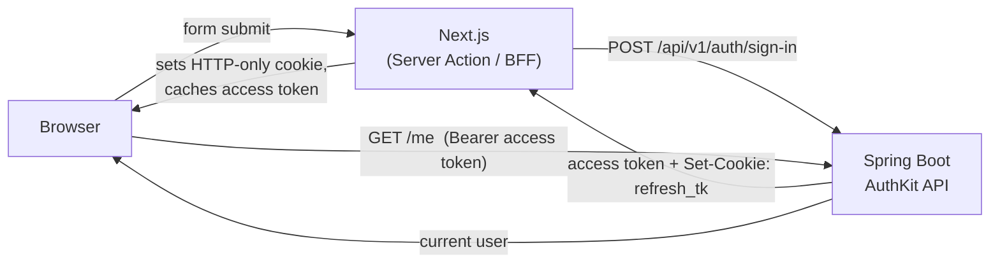

# 🔐 AuthKit

> A reusable, drop-in **authentication microservice** — clone it, start it, and you have working sign-up, sign-in, JWT sessions, roles, Swagger and tests on day one.

AuthKit is a small monorepo with a **Spring Boot** backend and **two interchangeable frontends** — a **Next.js** web app and a **React Native** mobile app — that each implement the same complete, production-style auth flow against the one backend:

> **Clone it, then pick your frontend:** building a website? Use `apps/web` (Next.js). Building a mobile app? Use `apps/mobile` (React Native). Both talk to the same `apps/backend` and share the same auth model, screens and design — so you can switch or keep both.


- ✅ Sign-up & sign-in with server-side validation
- ✅ Short-lived **access token** (15 min) + long-lived **refresh token** (30 days) in an **HTTP-only cookie**
- ✅ Stateless JWT security, role-based authorization (`USER` / `ADMIN`)
- ✅ A protected example route (`GET /me`) and an admin-only route (`@PreAuthorize`)
- ✅ Live **Swagger UI** with an `Authorize 🔒` button
- ✅ Modern frontend: App Router, **Redux Toolkit Query**, **Server Actions** (BFF), route protection via `proxy.ts`
- ✅ Tests everywhere: Spring integration tests, Vitest unit tests, Playwright e2e (with a throwaway DB)
- ✅ One `docker compose up` away from running

It was extracted, almost 1:1, from a production app — so it is not a toy. Use it as the starting point for any new project that needs auth, and as a reference for how the pieces fit together.

---

## 🚀 Quick start (the 60-second version)

```bash
# 1. Start the database + backend (+ a mirrored Swagger UI)
docker compose up -d

# 2a. …then start the WEB frontend (Next.js)
cd apps/web
npm install
npm run dev          # → http://localhost:3000

# 2b. …OR start the MOBILE frontend (React Native / Expo)
cd apps/mobile
npm install
npx expo start       # → press i / a, or scan the QR with Expo Go
```

Open the web app at **http://localhost:3000** (or launch the mobile app), register — and you land on a dashboard that says *"You made it!"* 🎉

> Mobile note: on an emulator/phone, `localhost` is the device, not your computer. See [apps/mobile/README.md](apps/mobile/README.md) for the per-platform backend URL.

> No configuration needed: every value has a sensible default. See [docs/RUNNING.md](docs/RUNNING.md) for all the variations (full Docker, manual dev, individual services).

---

## 🗺️ What's in the box

```
authkit/
├── apps/
│   ├── backend/        Spring Boot 4 · Java 21 · JWT · Spring Security · springdoc
│   ├── web/            Next.js 16 · React 19 · Redux Toolkit Query · Tailwind v4 · shadcn/ui
│   └── mobile/         Expo · React Native · Expo Router · NativeWind · Redux Toolkit Query
├── docker-compose.yml         Postgres + backend + Swagger UI
├── docker-compose.test.yml    Throwaway Postgres for e2e tests
└── docs/                      You are here-ish
```

---

## 📚 Documentation

| Document | What it covers |
|----------|----------------|
| [docs/ARCHITECTURE.md](docs/ARCHITECTURE.md) | How it all fits together + **flow diagrams** (who calls whom, in what order) |
| [docs/BACKEND_FLOW.md](docs/BACKEND_FLOW.md) | **Detailed backend call graph** — controller → service → repository → DB, per endpoint, incl. the security filter chain |
| [docs/RUNNING.md](docs/RUNNING.md) | Every way to run it, all Docker instances, ports and environment variables |
| [docs/SWAGGER.md](docs/SWAGGER.md) | Using the live API docs and the `Authorize 🔒` button |
| [docs/TESTING.md](docs/TESTING.md) | Backend integration tests, frontend unit tests, Playwright e2e |
| [docs/SECURITY.md](docs/SECURITY.md) | The token/cookie model and what to harden before production |
| [docs/CUSTOMIZING.md](docs/CUSTOMIZING.md) | Change the roles, add endpoints, re-theme, and remove the fun gag |

---

## 🧭 The auth flow at a glance



Full sequence diagrams (sign-up, sign-in, silent refresh, protected request) live in [docs/ARCHITECTURE.md](docs/ARCHITECTURE.md). For the **detailed backend call graph** — every hop from controller through service to repository and database, plus the security filter chain — see [docs/BACKEND_FLOW.md](docs/BACKEND_FLOW.md).

---

## 🔌 API surface

| Method | Route | Auth | Purpose |
|--------|-------|------|---------|
| `POST` | `/api/v1/auth/sign-up` | public | Create an account, returns access token + sets refresh cookie |
| `POST` | `/api/v1/auth/sign-in` | public | Authenticate, returns access token + sets refresh cookie |
| `GET`  | `/api/v1/auth/access-tk` | refresh cookie | Exchange the refresh cookie for a fresh access token |
| `GET`  | `/api/v1/me` | access token | The current user (example protected route) |
| `GET`  | `/api/v1/admin/ping` | access token + `ADMIN` | Role-protected example route |

Explore them live at **http://localhost:8080/api/v1/swagger-ui.html**.

---

## 🛠️ Tech stack

**Backend:** Spring Boot 4, Java 21, Spring Security, JJWT, Spring Data JPA, PostgreSQL / H2, springdoc-openapi.
**Web frontend:** Next.js 16 (App Router), React 19, Redux Toolkit Query, react-hook-form + Zod, Tailwind CSS v4, shadcn/ui, sonner.
**Mobile frontend:** Expo, React Native, Expo Router, NativeWind, Redux Toolkit Query, react-hook-form + Zod, sonner-native, expo-secure-store.
**Testing:** JUnit 5 + MockMvc + Spring Security Test, Vitest + Testing Library, Playwright.

---

## 📄 License

Use it, fork it, build on it. AuthKit is meant to be copied into your own projects.
