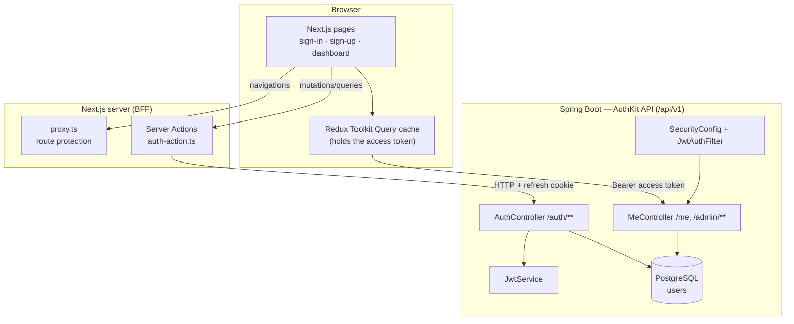
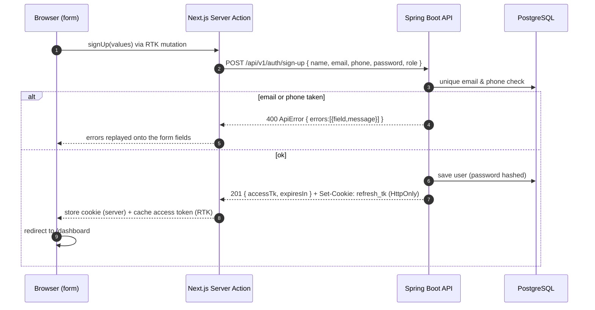
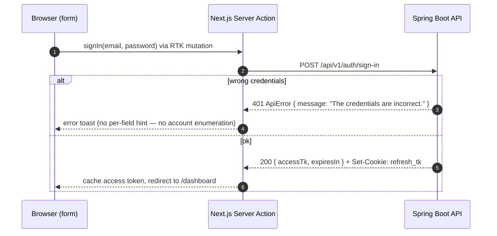
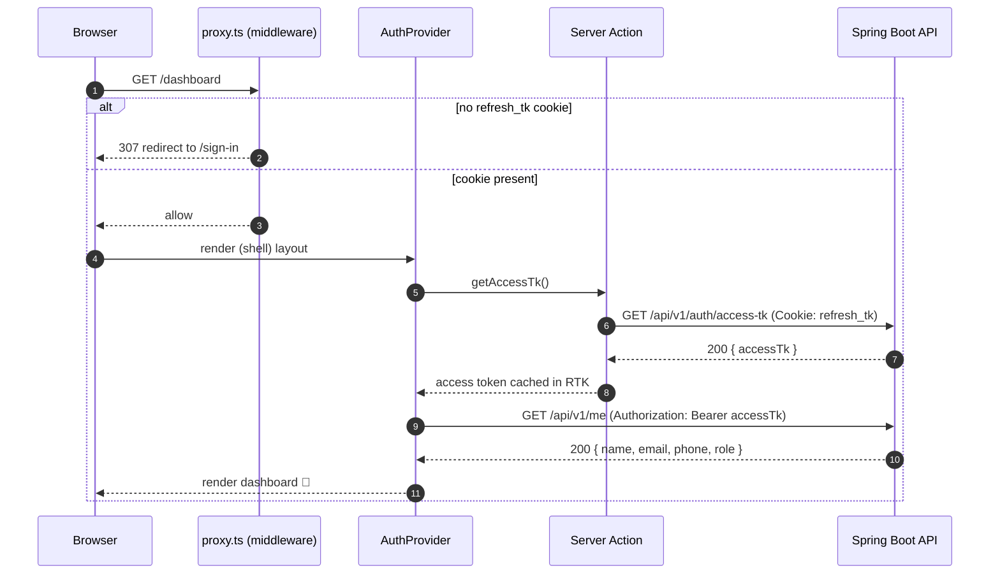
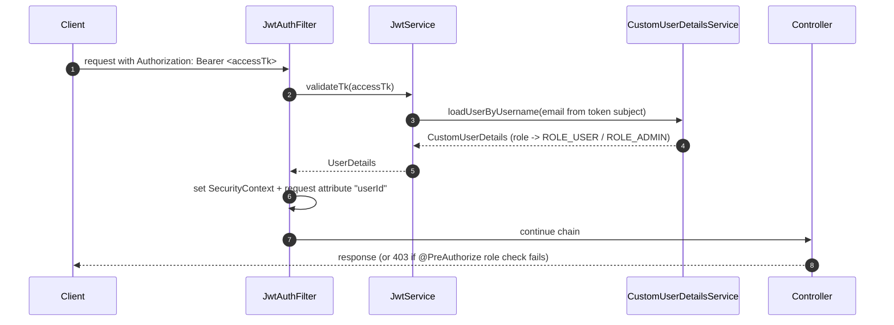

# Architecture & flow diagrams

This document explains how AuthKit's pieces fit together and — most importantly —
**which service calls which, and in what order**. All diagrams are Mermaid, so
GitHub renders them automatically.

---

## 1. The components

**Why a BFF?** The auth calls go through **Next.js Server Actions**, not directly
from the browser. That lets the server read/write the `refresh_tk` cookie as
**HTTP-only** — it is never exposed to client-side JavaScript. The short-lived
access token, by contrast, lives only in the RTK Query cache in memory and is
attached as a `Bearer` header to normal API calls.

---

## 2. Sign-up

---

## 3. Sign-in

---

## 4. Loading the protected dashboard (silent refresh + /me)

### The reverse: already signed in

The same cookie check works the other way around. If you **already** have a
`refresh_tk` cookie and open the landing page (`/`), `/sign-in` or `/sign-up`,
`proxy.ts` sends you **straight to `/dashboard`** — no reason to show the
marketing or auth pages again. The landing-page redirect adds a `?redirected=1`
flag, and the dashboard shows a short "you're already signed in" note so the
convenience redirect is visible rather than magic. (The AuthKit logo in the
header intentionally links to `/`, so clicking it from the dashboard demonstrates
this exact bounce.)

The **mobile app** reproduces this without middleware: the landing screen checks
the keystore for a refresh token on mount and `router.replace`s to the dashboard
(with the same flag) when one is present — see `app/index.tsx` and
`components/AuthProvider.tsx`.

---

## 5. How a request gets authenticated on the backend

The filter is registered **only** inside the Spring Security chain (a disabled
`FilterRegistrationBean` stops Spring Boot from also wiring it up as a global
servlet filter, which would otherwise run it twice). See
[SECURITY.md](SECURITY.md) for the details.

> Want the *fully detailed* call graph — every hop from controller through
> service to repository and database, the bean dependency graph and the filter
> chain order? See **[BACKEND_FLOW.md](BACKEND_FLOW.md)**.

---

## 6. Token & cookie model

| Token | Lifetime | Where it lives | Sent how |
|-------|----------|----------------|----------|
| **Access token** | 15 minutes | RTK Query cache (memory) | `Authorization: Bearer …` header |
| **Refresh token** | 30 days | `refresh_tk` **HTTP-only** cookie (web) / **OS keystore** via expo-secure-store (mobile) | browser cookie jar → BFF (web) / explicit `Cookie:` header (mobile) |

The backend is **stateless** — it stores no sessions. Signing out simply deletes
the refresh token (cookie on web, keystore entry on mobile); any still-valid
access token expires on its own within 15 minutes.

> **Two frontends, one backend.** `apps/web` (Next.js) and `apps/mobile` (React
> Native / Expo) are interchangeable clients of the same API. The only real
> difference is *where the refresh token lives* — an HTTP-only cookie managed by
> Next.js Server Actions on the web, versus the OS keystore on mobile (which
> reads the `Set-Cookie` header and replays it as a `Cookie:` header). The Redux/
> RTK Query layer, the Zod schemas and the screens are otherwise near-identical.
