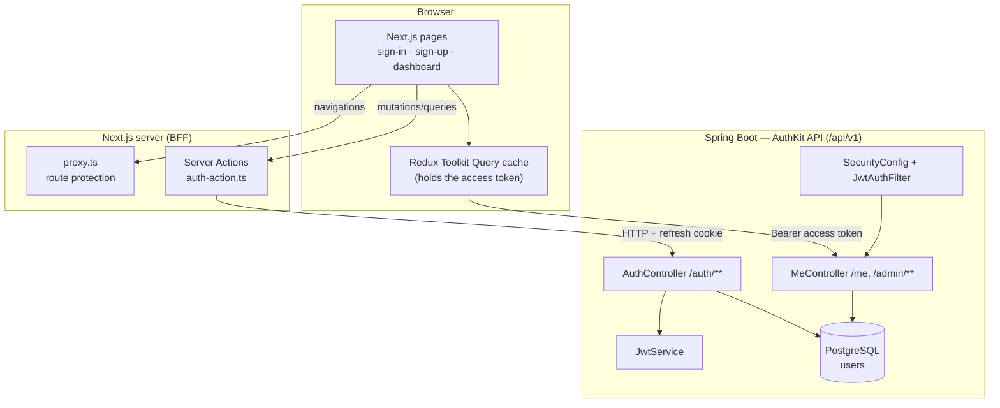
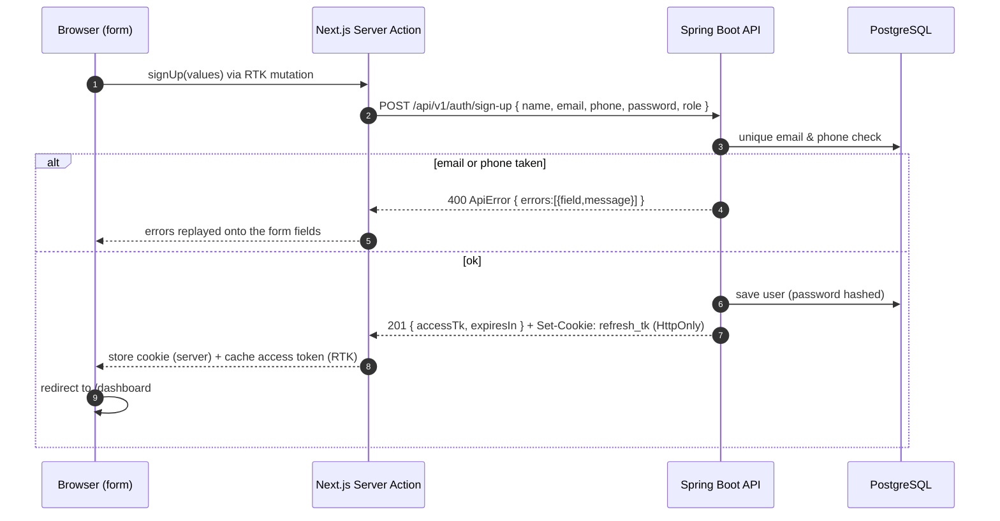
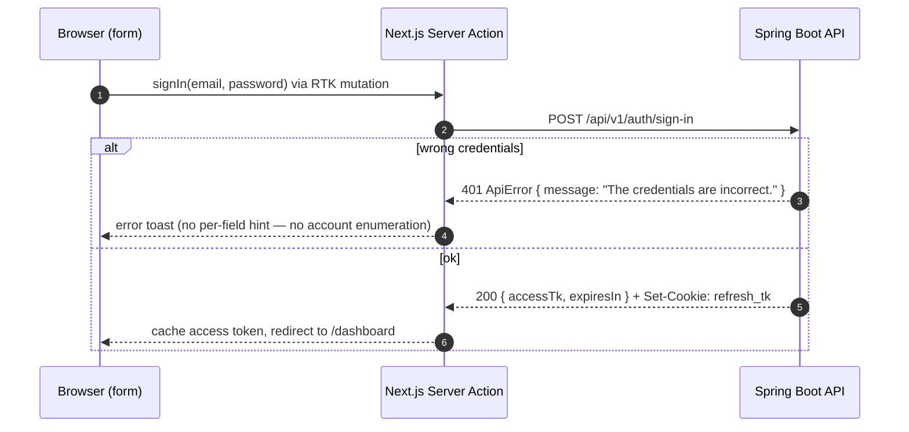
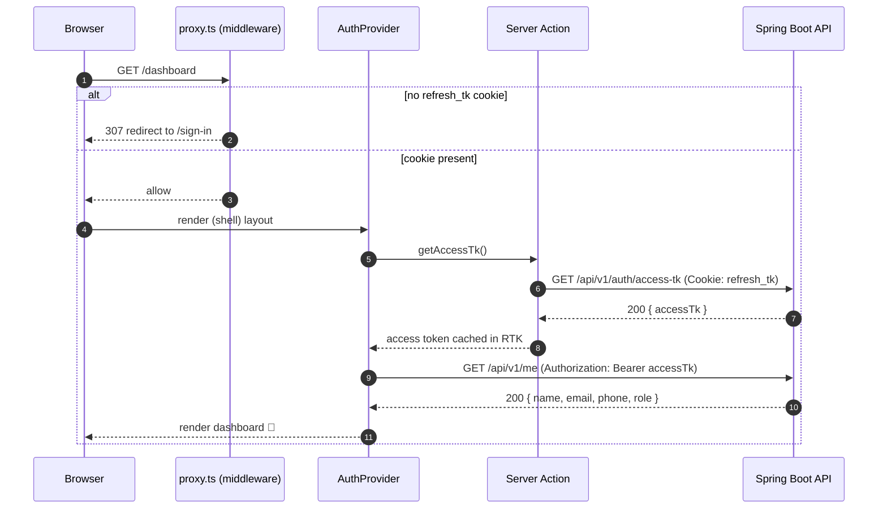
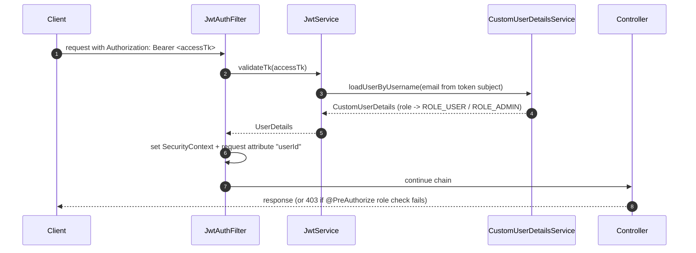

# Architecture & flow diagrams

This document explains how AuthKit's pieces fit together and — most importantly —
**which service calls which, and in what order**. All diagrams are Mermaid, so
GitHub renders them automatically.

---

## 1. The components

**Why a BFF?** The auth calls go through **Next.js Server Actions**, not directly
from the browser. That lets the server read/write the `refresh_tk` cookie as
**HTTP-only** — it is never exposed to client-side JavaScript. The short-lived
access token, by contrast, lives only in the RTK Query cache in memory and is
attached as a `Bearer` header to normal API calls.

---

## 2. Sign-up

---

## 3. Sign-in

---

## 4. Loading the protected dashboard (silent refresh + /me)

---

## 5. How a request gets authenticated on the backend

The filter is registered **only** inside the Spring Security chain (a disabled
`FilterRegistrationBean` stops Spring Boot from also wiring it up as a global
servlet filter, which would otherwise run it twice). See
[SECURITY.md](SECURITY.md) for the details.

> Want the *fully detailed* call graph — every hop from controller through
> service to repository and database, the bean dependency graph and the filter
> chain order? See **[BACKEND_FLOW.md](BACKEND_FLOW.md)**.

---

## 6. Token & cookie model

| Token | Lifetime | Where it lives | Sent how |
|-------|----------|----------------|----------|
| **Access token** | 15 minutes | RTK Query cache (memory) | `Authorization: Bearer …` header |
| **Refresh token** | 30 days | `refresh_tk` **HTTP-only** cookie | automatically by the browser to the BFF |

The backend is **stateless** — it stores no sessions. Signing out simply deletes
the refresh cookie; any still-valid access token expires on its own within 15
minutes.
