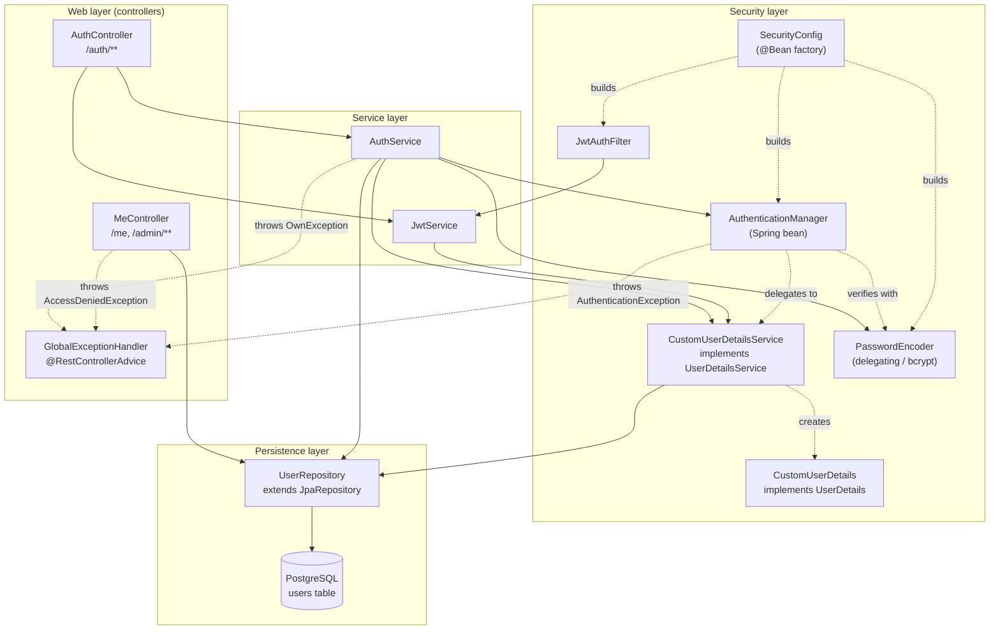
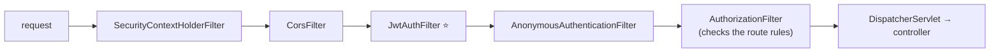
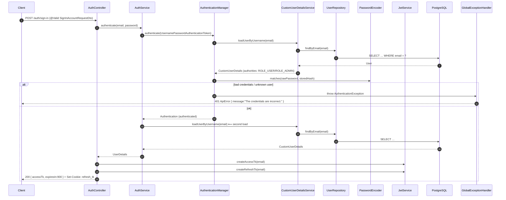
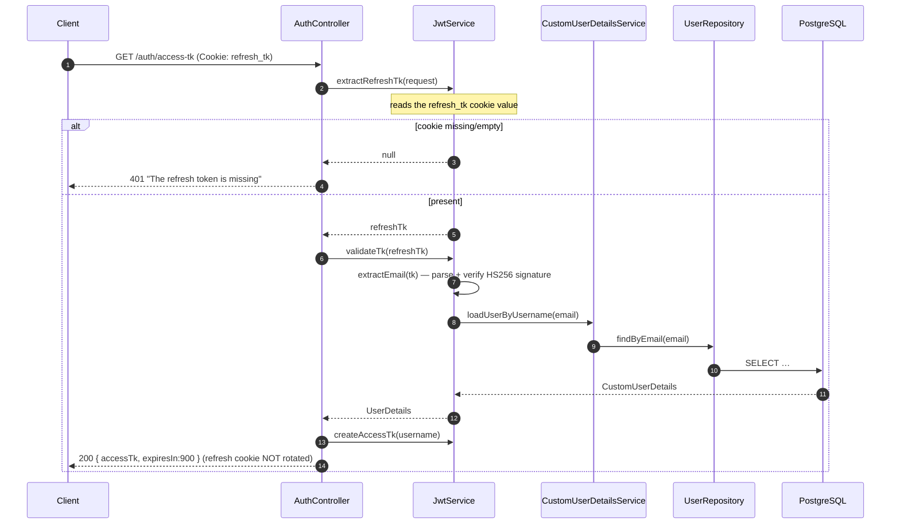
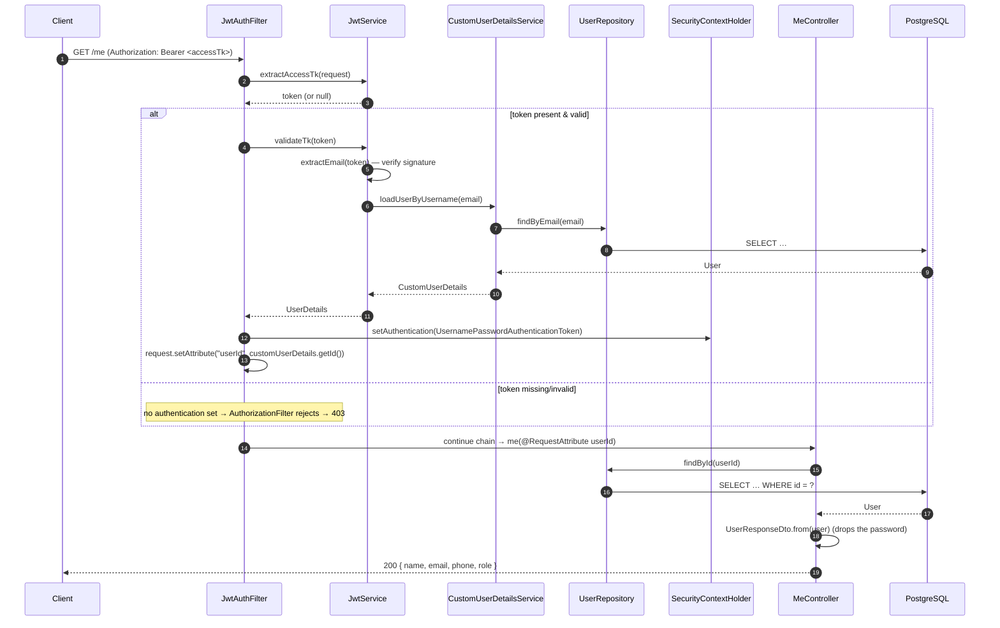
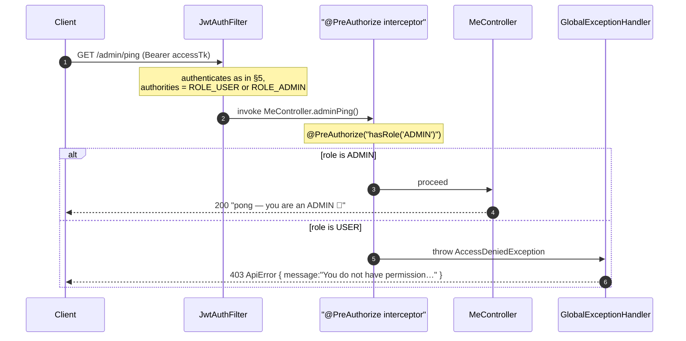

# Backend flow — in detail (controller → service → repository → DB)

This document traces **every call** the Spring Boot backend makes, per endpoint,
all the way from the controller down to the repository and the database, including
the security filter chain and the error branches. If [ARCHITECTURE.md](ARCHITECTURE.md)
is the bird's-eye view, this is the wiring diagram.

All diagrams are Mermaid (rendered automatically by GitHub).

---

## 0. Bean / dependency graph

Who is injected into whom (constructor injection via Lombok `@RequiredArgsConstructor`),
grouped by layer.



> `UserDetailsService` is an interface; the concrete bean is
> `CustomUserDetailsService`. `AuthService`, `JwtService` and the Spring
> `AuthenticationManager` all resolve to it.

---

## 1. The security filter chain (runs before every controller)

Order of the filters in the one `SecurityFilterChain` built by `SecurityConfig`.
`JwtAuthFilter` is inserted just before `UsernamePasswordAuthenticationFilter`.



Route rules (from `SecurityConfig.securityFilterChain`):

| Matcher | Rule |
|---------|------|
| `OPTIONS /**` | permit all (CORS pre-flight) |
| `/auth/**` | permit all (public) |
| `/swagger-ui/**`, `/v3/api-docs/**` | permit all |
| everything else | `authenticated()` |

> `JwtAuthFilter` is registered **only** inside this chain. A disabled
> `FilterRegistrationBean<JwtAuthFilter>` in `SecurityConfig` prevents Spring Boot
> from *also* registering it as a global servlet filter (which would run it twice).

---

## 2. `POST /auth/sign-up`

```mermaid
sequenceDiagram
    autonumber
    participant C as Client
    participant AC as AuthController
    participant AS as AuthService
    participant UR as UserRepository
    participant PE as PasswordEncoder
    participant JS as JwtService
    participant DB as PostgreSQL
    participant GEH as GlobalExceptionHandler

    C->>AC: POST /auth/sign-up (@Valid SignUpAccountRequestDto)
    Note over AC: @Valid runs Bean Validation first;<br/>failure → MethodArgumentNotValidException → GEH → 400
    AC->>AS: signUp(dto)
    AS->>UR: findByEmail(email)
    UR->>DB: SELECT … WHERE email = ?
    DB-->>UR: Optional<User>
    UR-->>AS: Optional<User>
    AS->>UR: findByPhone(phone)
    UR->>DB: SELECT … WHERE phone = ?
    DB-->>AS: Optional<User>

    alt email or phone already taken
        AS->>GEH: throw OwnException(fieldErrors)
        GEH-->>C: 400 ApiError { errors:[{field,message}] }
    else unique
        AS->>PE: encode(rawPassword)
        PE-->>AS: "{bcrypt}…" hash
        AS->>UR: save(User{…, password=hash})
        UR->>DB: INSERT INTO users …
        DB-->>AS: persisted User (with generated UUID)
        AS-->>AC: User
        AC->>JS: createAccessTk(email)
        JS-->>AC: access JWT (15 min)
        AC->>JS: createRefreshTk(email)
        JS-->>AC: refresh JWT (30 days)
        Note over AC: adds Cookie refresh_tk (HttpOnly, Path=/, 30d)
        AC-->>C: 201 { accessTk, expiresIn:900 } + Set-Cookie: refresh_tk
    end
```

---

## 3. `POST /auth/sign-in`

Note the two-step authentication: the `AuthenticationManager` verifies the
credentials (which itself loads the user + checks the password), and then
`AuthService` loads the `UserDetails` again to return it.



> **Detail worth knowing:** `loadUserByUsername` runs **twice** on sign-in — once
> inside the `AuthenticationManager` and once explicitly in `AuthService`. It's
> correct, just a minor optimization opportunity (the manager already returns the
> authenticated principal you could reuse).

---

## 4. `GET /auth/access-tk` (silent refresh)



---

## 5. `GET /me` (protected route — the full chain)

This shows the filter authenticating the request *and* the controller handling it.



---

## 6. `GET /admin/ping` (role-based authorization)



---

## 7. Where each thing lives

| Concern | Class | Path |
|---------|-------|------|
| Public auth endpoints | `AuthController` | `auth/AuthController.java` |
| Sign-up rules + credential check | `AuthService` | `auth/AuthService.java` |
| JWT create/parse/extract | `JwtService` | `auth/JwtService.java` |
| Per-request auth | `JwtAuthFilter` | `auth/security/JwtAuthFilter.java` |
| Spring Security wiring | `SecurityConfig` | `auth/security/config/SecurityConfig.java` |
| Principal lookup | `CustomUserDetailsService` | `auth/security/CustomUserDetailsService.java` |
| `User` → `UserDetails` adapter | `CustomUserDetails` | `auth/security/CustomUserDetails.java` |
| Protected example routes | `MeController` | `user/MeController.java` |
| Entity | `User` | `common/entities/User.java` |
| Repository | `UserRepository` | `common/repositories/UserRepository.java` |
| Error → HTTP mapping | `GlobalExceptionHandler` | `common/exception/GlobalExceptionHandler.java` |
| Swagger / Authorize button | `OpenApiConfig` | `config/OpenApiConfig.java` |
